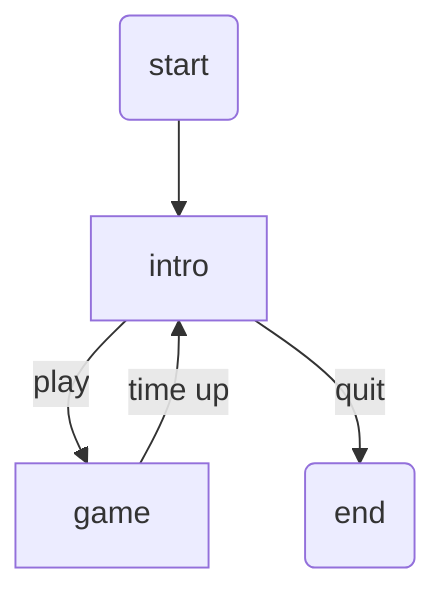

README.md

# Chicken and Eggs

## Overview
You are a hen. You have laid some beautiful eggs.  But they are rolling all
over the yard.  How many eggs can you pick up in 30 seconds?
There is more than one type of egg.  You can get extra time, but is it worth it?

## Technical overview

This will be a classic 2D arcade game.  The user controls an animated chicken that
can run around a farmyard.  The chicken will be controlled by arrow keys.
There are 10 eggs rolling around in the yard. The hen can collect an egg by running
into it.  The egg will then be reset, giving you an unlimited number of eggs.
At the beginning of the game, you will have 30 seconds.  If the chicken collects a blue
egg, a few more seconds will be added to the timer.
However, adding time also adds a red egg.  If the chicken hits any red egg, you drop 5 eggs.
You can add as much time as you want, but every time you do, it makes it 
harder to avoid the red eggs.  This leads to a frantic and fun game, with a surprising
level of strategy:  Is it better to leave the extra time alone to ensure you do not
lose your eggs?  That is up to the player.  These details will be hinted at in the opening
screen, but the player will discover this dynamic as they play.

## Primary Sprites

### Chicken
The chicken will be a subclass of the simpleGE sprite.  It will start as a colored rectangle
but eventually we will add a simple animated spritesheet chicken image from openGameArt.
The chicken will be controlled by the arrow keys.  It will use the default wrapping operation
when it leaves the screen. The chicken is always present in the game.  It is not born, nor does
it ever die. 

The chicken will be 32x32, as that is the size of a single frame of the animation.
At first the chicken can be a static image, but eventually it will contain an animation.  
The animation will be based on a sprite sheet with for rows and three columns.  Each row represents
a direction, and shows a simple 3-frame animation of the chicken travelling in that direction. 
Animation will be managed through a simpleGE SpriteSheet object.

## Egg
The standard egg class is relatively simple.  It will be based on an image from openGameArt,
resized to 15x15 pixels. All eggs will use the default wrapping behavior when leaving the 
screen.

The egg will have a reset method, which will
 * place the egg at a random spot on the screen
 * give the egg a random dx and dy between -3 and +3

When the chicken hits a standard egg:
 * 1 point will be added to the score
 * the egg will be reset
 
## Blue Egg
This is a subclass of the egg, tinted blue.  It is not really different from the standard egg except
the name and the color.  

When the chicken hits the blue egg:
  * 10 seconds will be added to the timer
  * a positive sound effect will be played
  * the blue egg will reset
  * another red egg will be added to the scene
  
There will always be exactly one blue egg in the scene

## Red Egg
This is also a subclass of the egg, tinted red.  It is not really different from the standard egg except
for the name and the color. Since there is a variable number of red eggs, we'll make a separate sprite
group for them.

When the chicken hits any red egg:
  * subtract 5 from the score
  * a negative sound effect will be played
  * the red egg will reset
  
The game will start with a single red egg.  Every time the player adds more time, another red egg is 
added, making an interesting difficulty loop. It's possible we will slow down the red eggs to make the 
game a little more fair.  

## Labels in the main game class:
The main class will have two labels:
  * lblScore will hold the current score. It will be updated every time the score changes
  * lblTime will hold the time remaining. It will be updated on every frame

# The Intro class

Intro will be a basic scene describing the game and how to play it.  The game class will present the 
previous score.  It will also have a multilabel showing game instructions.  It will have two buttons.
Both buttons end the intro class, but set a response variable first, so the main function can determine
what will happen next.

For fun and continuity, the intro scene uses the same grass background as the game, and features eggs
randomly moving in the background.

# The game class

## Initialization

The primary class is the game class.  It will have a number of primary elements:
 * chicken - an instance of the chicken
 * eggs - a list of standard eggs
 * blueEgg - a single blue egg
 * redEggs - a spriteGroup of red eggs, starting with 1
 * lblScore - a label showing the current score
 * lblTimer - a label showing the remaining time
 
There are some other assets belonging to the game class:

 * score - an integer containing the current score. Starts at zero
 * timer - a simpleGE timer,with totalTime set to 30 seconds
 * bock - a sound effect used when the chicken collects an egg
 * moreTime - a sound effect used when the chicken collides with a blue egg
 * loseEggs - a sound effect used when the chicken collides with a red egg
 * a background sound, loaded through the pygame.mixer.music functionality

All assets are initialized in the Game class' init method

## Sprite groups
All sprite assets except red eggs are added to the Game class primary sprite list.
However, since the redEgg list is dynamically sized, it makes sense for this to be
a separate sprite group.  This is generated by simpleGE.Scene.makeSpriteGroup() and 
simpleGE.Scene.addGroup()

## the Game process method
All of the event handling happens in the process method of the game. This involves
checking for collisions and the passage of time. On every frame, check the following

 * did chicken collide with a standard egg?
   * if so, add score and reset the egg
 * did chicken collide with a blue egg?
   * if so, add 5 seconds to timer, and reset blue egg
 * did chicken collide with a red egg?
   * if so, subtract from the score and reset red egg.
 * update lblTimer to reflect the new time left
 * if the time remaining is less than zero seconds, end the game
 * Each collision type will have an associated sound effect, to provide immediate feedback

# State Transition

 
# Asset List
This game uses the following assets.  All are either original or on a creative commons license
 * chicken spritesheet - AntumDeluge: https://opengameart.org/content/lpc-chicken-rework  
 * egg image- GoopyBus: https://opengameart.org/content/egg-item-sprite
 * colored eggs - modified AJH in Gimp
 * grass - LuminousDragonGames: https://opengameart.org/content/blended-textures-of-dirt-and-grass
 * background music - congusbongus: https://opengameart.org/content/chicken-n-corn
 * chicken sound effect - ImadeIt: https://opengameart.org/content/chicken-sound-effect (modified AJH)
 * powerUp.wav, hitHurt.wav - AJH in jsfxr: https://sfxr.me

# Milestone plan
* Basic Game scene with background
* Chicken with placeholder, keyboard motion
* Standard egg with placeholder
* Chicken - egg collision
* Scorekeeping / timing
* Game state management
* More time powerup
* Fewer eggs powerdown
* Sound effects
* Chicken animation / graphics improvements
* gamepad input

# Stretch Goals

 * tune up gameplay. adjust speed of eggs, behaviour of red and blue eggs (done)
 * add gamepad functionality (done)
 * add a high score feature (in progress)

 

